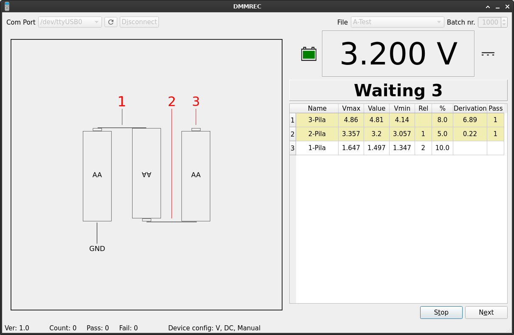
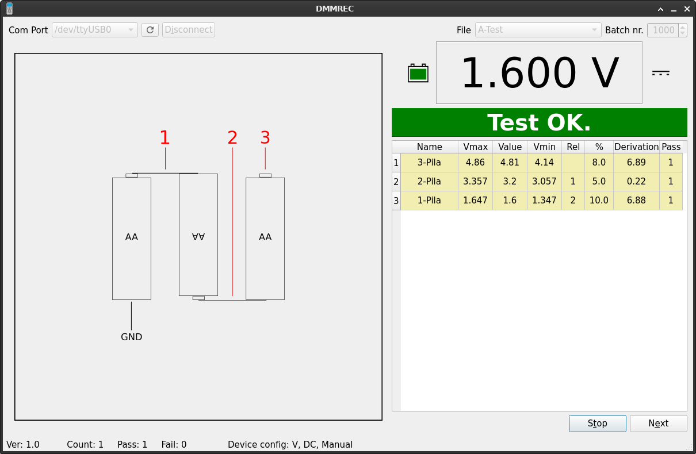

# DMMREC
Capture data program for TENMA 72-2610 (UNI-T like) Digital Multimeter.

# This program has been written to assist in the manufacture of electronic products.

 I make no warranty or responsibility for anything associated with this program.
 Use it at your responsibility and risk.

# Exec:
 This program is writen in Python 3.9.2 using pyside for GUI.
 All was developed in a Debian system, under a virtual enviroment.  
 
 First get virtual enviroment for python (It is not essential but it is very useful):
   - Search on internet how to install virtual enviroment, I use: https://atareao.es/como/entorno-virtual-en-python-como-y-para-que/  (thanks).
       - sudo apt install python3-venv
       - mkdir python  (a folder for virtualenviroment where you want or can)
       - cd python
       - python3 -m venv [foldername]
       - cd foldername/bin/
       - source activate (now the prompt has changed). 
       - pip install pyside2
       - pip install serial
       - pip install simpleaudio
       - pip install pyinstaller

 Second, need acces to serial port:
 - sudo usermod -a -G dialout $USER (need restart)
       
 Third, execute or make an executable:
 - download all files included directories and put all together somewhere.
 - Go to virtual enviroment [foldername]/bin
 - Open terminal
 - source activate (now the prompt has changed).
 - cd "folder where DMMREC.py and other files were"
 - python DMMREC.py to execute.
 - pyinstaller DMMREC.spec to make one binary file (in folder dist) to exec where you want. 
       
       

# Description of files:
  - DMMREC.ini: 
    This file contains settings that are essential for the program job.
  - DMMREC.py: 
    This is the program file.
  - DMMREC.spec: 
    This is only for pyinstaller.
  - DMMBREC.ui: 
    xml file for GUI. (I use Qt Designer to create this).
  - DMMREC1.wav: 
    Sound example for program.
  - DMMREC2.wav: 
    Sound example for program.
  - DMMREC_ui.py: 
    The python GUI library (usually to convert from xml file: pyside2-uic -o DMMREC_ui.py DMMREC.ui )
  - libdmmut61b.py: 
    A library to convert DMM data.
  - lib_ini.py: 
    A library to manage ini files.
  - A-Test.ini: 
    An example file for the program.
  - A-Test.png: 
    An example image for the program.
  - Iconos:
    A folder with images needed by program.

# Use of the program:
  - Create your own file (good way is copy A-Test.ini and modify it).
  - Create your image file (I like inkscape to convert Silkscreen data from PCB to add test point).
  - Move file and image to folders (the path the program search was in DMMREC.ini file).
  - Exec bin.
  - Select Com Port.
  - Select File.
  - Set Batch nr.
  - Put your DMM in RS232 mode and configure 
  - Push button "Connect" in soft.
  - Push button start and check all points in your file (if need you can skip some with "next" button).
  - All data you see in table will be recorded when cicle ends on log file (one for every file and batch nr). 
  
  

  
